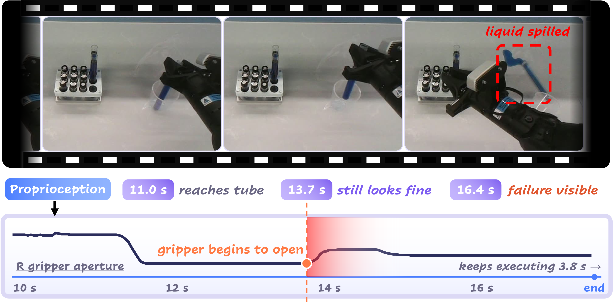

# ProTracer: Proprioception-Guided Failure Diagnosis in Robot Manipulation

Chang Dong, Mehdi Hosseinzadeh, King Hang Wong, Lingqiao Liu, Francois Fraysse, Feras Dayoub, Minh Hoai Nguyen

Adelaide University

[Project Page](https://chang-aiml.github.io/ProTracer/) · arXiv (coming soon)



## Code

The implementation and the FailTime annotations are in [`code/`](code). See [`code/README.md`](code/README.md) to get started.

## Citation

```bibtex
@article{dong2026protracer,
  title  = {ProTracer: Proprioception-Guided Failure Diagnosis in Robot Manipulation},
  author = {Dong, Chang and Hosseinzadeh, Mehdi and Wong, King Hang and Liu, Lingqiao and Fraysse, Francois and Dayoub, Feras and Nguyen, Minh Hoai},
  year   = {2026}
}
```
